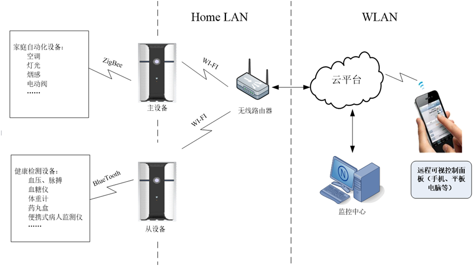

SmartHome数据中心网络协议
=========================
本协议约定SmartHome智能网关设备与云端服务器（接入服务平台的数据中心）之间的数据通信技术要求。

一、网络结构
-----------
### 由健康检测传感器类设备、家居自动化类设备、家居基础平台设备和云端服务器，以及各种客服端APP组成。拓扑结构图如下：


二、智能网关与数据中心（信息平台）协议
-----------------------------------
* 数据中心（以下简称中心）与智能网关（以下简称网关）间的网络协议说明
* 中心与网关间通信时采用[ZeroMQ](http://zeromq.org)作为报文交换协议，报文内数据采用JSON协议进行封装
* 中心与网关间的接口采用Router/Dealer模式，中心要有固定的IP地址
* 中心绑定端口: tcp://*:20000，采用Router模式
* 网关主动发起连接，采用Dealer模式，每台网关有不同的机器编号（简称gid），与网关相连的每台数据采集设备都有不同的ID号（简称uid）
* 每个与中心成功建立的连接都有自己的socket identity（简称sid）
* 中心可以维护一个网关地址列表，记录每台网关的gid与其对应的sid, 以用于通过中心向指定gid的网关发送命令
* 中心记录每台网关最新发送数据包的时间用于超时判断网关是否断开连接

三、协议结构
-----------
网关与中心之间传输的报文格式定义：
ZeroMQ传输的报文可以包括多帧消息，本协议的报文采用`一`至`多`个消息帧组成。其中第一帧为以JSON封装的报文详细信息定义，是必选项；第二帧开始为文件内容数据帧，是可选项，只有在需要传输文件内容时才包含。

四、中心需要支持的具体协议定义如下：
--------------------------------
### 1. 来自于网关的数据上传命令，网关在网络不通时缓存收集到的所有数据，在网络恢复后主动发送所有没有上传成功的数据
```JSON
{
    "gid": "45007730000801",
    "uid": "temphumi.1",
    "time": "2017-05-08 19:06:08",
    "data": {
        "time":"2017-05-08 19:06:08",
        "raw":"DDAA0011223344556677EEDD",
        "humidity":50.9,
        "temperature":26.8
    }
}
特点：包含有gid,uid,time,data属性，肯定没有cmd属性，data属性为表格，data中的time表示数据采集时间，
  raw为设备返回的原始数据包，其它属性由采集协议自行定义
应答：中心在正确处理完数据保存等相关操作后，必需返回如下确认数据包
{
    "status": 0,
    "ack": "temphumi.1",
    "time": "2017-05-08 19:06:08"
}
其中：
  status表示命令处理状态，0表示没有错误
  ack为对应数据上传数据包中的uid
  time为对应数据上传数据包中的time(注意: 不是data中的time)
```
#### 报文字段说明
字段 | 类型 | 必要性 | 说明
--- | --- | --- | ---
gid	| 字符串 | 必需 | 表示网关设备编号
uid	| 字符串| 必需 | 表示网关名称
time | 字符串（时间格式）| 必需 | 数据包上传时间(注意: 不是data中的time)
data | 实体 | 必需 | 表示对应uid设备的实时数据 	
data/time | 字符串（时间格式）| 必需 | 数据采样时间	
data/raw | HEX字符串| 可选项 | 网关设备返回的蓝牙设备原始数据包
data/humidity | 浮点数| 可选项 | 网关湿度传感器数据
data/temperature | 浮点数| 可选项 | 网关温度传感器数据

#### 应答字段说明
字段 | 类型 | 必要性 | 说明
--- | --- | --- | ---
status | 数值 | 必需 | 表示命令处理状态，0表示没有错误
ack	| 字符串| 必需 | 对应数据上传数据包中的uid
time | 字符串（时间格式）| 必需 | 对应数据上传数据包中的time(注意: 不是data中的time)

### 2. 中心发送给网关的命令数据包，用于对指定网关进行参数查询设置、系统复位、数据清理、恢复出厂设置、时间校准、系统升级等
```JSON
{
    "gid": "45007730000801",
    "cmd": {
        "gid": "45007730000899",
        "name": "gateway name description",
        "address": "gateway location address",
        "eth0": {
            "address": "172.168.1.123",
            "netmask": "255.255.255.0",
            "gateway": "172.168.1.254",
            "mac": "11:22:33:44:55:66"
        },
        "wlan0": {
            "address": "dhcp",
            "mac": "11:22:33:44:55:99"
        },
        "dns": ["8.8.8.8", "8.8.4.4"],
        "ntp": "s2g.time.edu.cn",
        "server":["username:password@tcp://usa88.net:20000", "tcp://usa88.net:20002"],
        "device":[
            {"uid":"temphumi.1","period":30,"raw":"DDBB7766554433221100FFEEDD"},
            {"uid":"temphumi.2","period":60,"mac":"","pin":"1234","report":"true"}
        ],
        "passphrase":"passphrase",
        "reboot":"passphrase",
        "restore":"passphrase",
        "cleardata":"passphrase",
        "datetime":"2017-05-08 19:06:08",
        "checkupdate":"url",
        "get": ["network", "device", "login", "bluetooth"]
    }
}
特点：包含有gid,cmd属性，此数据包也可能是中心在收到其它网关或客户端发来的，然后需要转发给相应网关，中心在收到的数据包中增加sid属性（标识发送此命令的连接），然后根据gid转发给指定的网关
      如果gid="*", 表示转发给所有在线的网关
      cmd中每个属性都是可选项，网关收到此命令后根据不同属性设置相应的系统参数，或者执行控制命令
应答：
{
    "status": 0,
    "sndcount": 1
}
其中：
  status表示命令处理状态，0表示没有错误
  sndcount表示转发成功的网关数量
```
### 3. 来自于网关对命令包的应答数据包
```JSON
{
    "status": 0,
    "gid": "45007730000801",
    "sid": "sock01",
    "result": "命令运行结果信息",
    "info": {
        "name": "gateway name description",
        "address": "gateway location address",
        "hardver": "2.0",
        "softver": "1.0",
        "eth0": {
            "address": "172.168.1.123",
            "netmask": "255.255.255.0",
            "gateway": "172.168.1.254",
            "mac": "11:22:33:44:55:66"
        },
        "wlan0": {
            "address": "dhcp",
            "mac": "11:22:33:44:55:99"
        },
        "dns": ["8.8.8.8", "8.8.4.4"]
        "ntp": "s2g.time.edu.cn",
        "server":["tcp://usa88.net:20000", "tcp://usa88.net:20002"],
        "username":"",
        "password":"",
        "bluetooth":[
            {"mac":"mac1", "uid":"uid1", "name":"name1", "status": 0},
            {"mac":"mac2", "uid":"uid2", "name":"name2", "status": 0},
        ]
    }
}
特点：包含有gid,result,sid属性
应答：无，中心不向网关返回应答，而是根据sid将此数据包转发到相应的网络连接
只有当网关收到的命令包的cmd中包含get属性时，上面的返回包中才会包含info属性
```
#### 报文字段说明
字段 | 类型 | 必要性 | 说明
--- | --- | --- | ---
status	| 数值   | 必需 | 表示命令的处理状态，0表示没有错误
gid     | 字符串 | 必需 | 网关的唯一标识码
sid     | 字符串 | 必需 | 网关与中心建立的连接socket identity
result  | 字符串 | 必需 | 命令执行有错误时的附加错误信息
info    | 实体   | 非必需 | 中心向网关下发的命令2中含有get字段时，才有info字段
info/name | 字符串 | 必需 | 网关名称
info/address | 字符串 | 必需 | 网关的地理位置信息
info/hardver | 字符串 | 必需 | 网关的硬件版本编号
info/softver | 字符串 | 必需 | 网关的软件版本编号
info/eth0/address | 字符串 | 必需 | 网关有线网络的IP地址
info/eth0/netmask | 字符串 | 必需 | 网关有线网络的子网掩码
info/eth0/gateway | 字符串 | 必需 | 网关有线网络的局域网网关地址
info/eth0/mac     | 字符串 | 必需 | 网关有线网卡的MAC地址
info/wlan0/address | 字符串 | 必需 | 网关无线网络的IP地址
info/wlan0/netmask | 字符串 | 必需 | 网关无线网络的子网掩码
info/wlan0/gateway | 字符串 | 必需 | 网关无线网络的局域网网关地址
info/wlan0/mac     | 字符串 | 必需 | 网关无线网卡的MAC地址
info/dns | 数组 | 必需 | dns服务器地址
info/ntp | 字符串 | 必需 | ntp服务器地址
info/server | 数组 | 必需 | 中心的网络地址
info/username | 字符串 | 必需 | 网关登录中心的用户名
info/password | 字符串 | 必需 | 网关登录中心的密码
info/bluetooth| 实体 | 非必需 | 中心下发的命令2中含有device字段时才有该字段
info/bluetooth/mac| 字符串 | 必需 | 蓝牙设备的MAC地址
info/bluetooth/uid| 字符串 | 非必需 | 未知蓝牙设备无uid
info/bluetooth/name| 字符串 | 必需 | 蓝牙设备的名称
info/bluetooth/status| 数值 | 非必需 | 当命令2中的optype为3,4,5时相应蓝牙设备的执行结果


### 4. 来自于网关的心跳包
```JSON
{
    "gid": "45007730000801",
    "time": "2017-05-08 19:06:08"
}
特点：包含有gid,time属性，当网关超过一定时间（1分钟）没有向中心发送数据包时自动发送心跳包给中心
应答：无，中心不向网关返回应答
```
### 5. 来自于命令行的状态获取命令包
```JSON
{
    "cmd": "status"
}
特点：只包含cmd属性
应答：返回中心维护的网关地址列表, 例如：
{
    "status":0,
    "gateways":{
        "45007720000801":{
            "datas":{
                "bluetooth":[
                    {"mac":"mac1", "uid":"uid1", "name":"name1", "time":"2016-05-08 23:58:09"},
                    {"mac":"mac2", "uid":"uid2", "name":"name2", "time":"2016-05-08 23:58:09"},
                ],
                "self":{"humidity":52.5,"temperature":26.9, "air":75, "time":"2016-05-08 23:58:09"}
            },
            "heartbeat":1462265811.1678,
            "sid":"sock01"
        }
    }
}
其中：
  status表示命令处理状态，0表示没有错误
  gateways为记录的所有成功连接的网关
```
#### 报文字段说明
字段 | 类型 | 必要性 | 说明
--- | --- | --- | ---
status	| 数值 | 必需 | 表示命令的处理状态，0表示没有错误
gateways| 实体 | 必需 |
bluetooth| 数组 | 非必需 | 已连接蓝牙设备列表
self | 实体 | 必需 | 网关自带传感器数据
self/humidity | 必需 | 数值 | 空气湿度
self/temperature | 必需 | 数值 | 温度
self/air | 数值 | 必需 | 空气质量
heartbeat | 数值 | 必需 | 该网关最新发送数据包的时间，用于超时判断
sid | 字符串 | 必需 | 该网关与中心建立的连接socket identity
